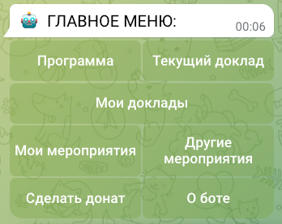
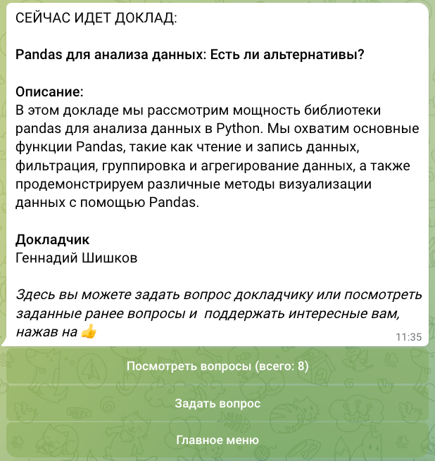
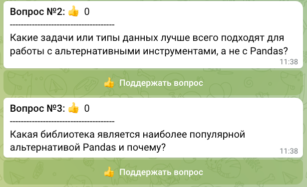
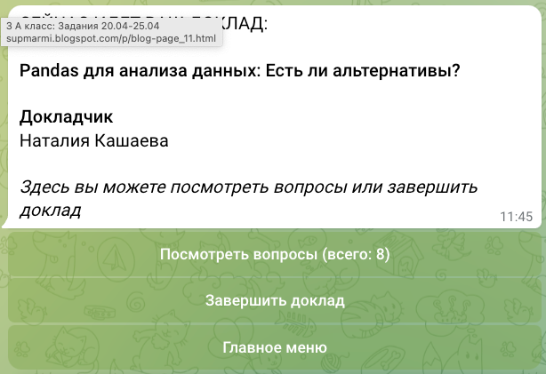
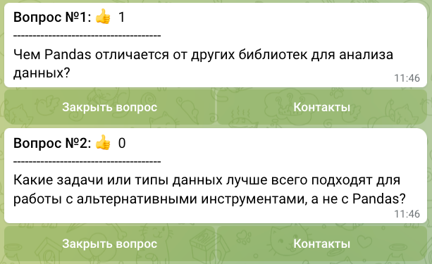
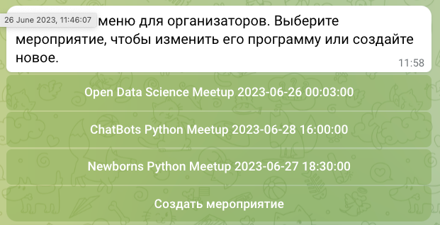

# PythonMeetup
Чат-бот для упрощения организации интерактивных событий, таких как конференции, семинары, вебинары и презентации.
Чат-бот предоставляет участникам возможность задавать вопросы спикерам в режиме реального времени. 
Также реализована возможность не только задать свой собственный вопрос, но и проголосовать 
за интересующие вас вопросы других участников.

## Как установить и запустить

Скачайте код с GitHub. Запустите установку зависимостей:
```commandline
pip install -r requirements.txt
```
Создайте файл `.env` в корневой директории. Внесите в него следующие данные:
```
TG_TOKEN_API=YOUR_TG_TOKEN
YOO_KASSA_PROVIDER_TOKEN=YOUR_KASSA_PROVIDER_TOKEN

DEBUG=True
ALLOWED_HOSTS='127.0.0.1'
```
Получить токен для телеграм-бота и приема платежей можно у [BotFather](https://t.me/BotFather).

Создайте базу данных:
```commandline
python manage.py migrate
```
Создайте суперпользователя:
```commandline
python manage.py createsuperuser
```

Запустите сервер:
```commandline
python manage.py runserver
```

Запустите телеграм-бота:
```
python manage.py runuserbot.py
```

## Как пользоваться ботом (для слушателей и докладчиков)

После запуска бота вводим команду `/start`. При первом использовании бот попросит пройти регистрацию. 
Нужно выбрать интересное Вам мероприятие и ввести Ваше имя и фамилию. После этого станет доступно главное меню:



Кнопки `Программа` и `Текущий доклад` доступны только во время проведения мероприятия.
Аналогично кнопки `Мои мероприятия` и `Другие мероприятия` доступны только если 
есть соответствующая информация для отображения. Подробнее об этом можно прочесть в меню `О боте`.

Кнопка `Мои доклады` доступна только для докладчиков. 

Кнопка `Текущий доклад` предоставляет различный функционал для слушателей и докладчика. 
Слушатели могут задавать вопросы или поддерживать вопросы других участников:

 

Докладчик может просматривать вопросы, закрывать вопросы, на которые уже ответил,
а также просматривать контакты слушателей, которых интересует тот или иной вопрос.





Выйти из любого меню и вернуться в главное поможет команда `/cancel`.

## Как пользоваться ботом (для организатора)

После запуска бота вводим команду `/admin`. Если у Вас есть права администратора, то Вы увидите меню:



Вы можете изменить программу существующего мероприятия или создать новое.

## Как пользоватья админкой

Для входа в админ-панель откройте ссылку /admin (например http://127.0.0.1:8000/admin)
и введите логин и пароль суперпользователя. Здесь можно создавать и удалять мероприятия,
добавлять и менять докладчиков, редактировать программу мероприятия и т.д.
Данная панель предоставляет удобный способ управления всеми данными, которые хранятся в базе данных.
